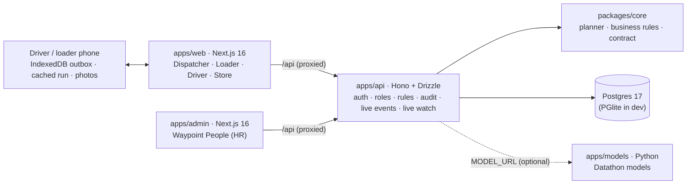

# DASH: delivery planning for Waypoint Group · Team Daffy Duck

Tech-Triathlon 2026 · Hackathon submission. **DASH** connects **ordering → planning → loading → delivery → receipt** for Waypoint Fresh, Style and Tech in one system:

- **Dispatchers** plan the day automatically and can override the plan. Every allocation respects the brief's operating constraints, and every deferred order states why.
- **Loaders and drivers** use phone apps that keep working with no signal.
- **Store managers** order, confirm delivery with a code and record what arrived.
- **HR** manages the people and their sign-ins in a separate panel, Waypoint People.

## For judges

| | |
|---|---|
| **Deployed system** | Operations app: https://daffyduck-dash.onrender.com · Waypoint People (HR): https://daffyduck-people.onrender.com (synthetic seed, Render free plan: the first visit after 15 idle minutes takes about a minute) |
| **Demo video** | [https://youtu.be/NtV_pmNhU5s](https://youtu.be/NtV_pmNhU5s): all four roles through one delivery day (5:45, unlisted) |
| **Repository** | [github.com/vihangasath/DaffyDuck_DASH](https://github.com/vihangasath/DaffyDuck_DASH) |
| **Run it yourself** | `docker compose up --build` starts the complete stack (Postgres, API with migrations and seed data, both apps). No configuration needed. See [Run it](#run-it) |
| **Walkthrough** | [Judge walkthrough](#judge-walkthrough): numbered, all four roles, from planning to receipt (about 10 minutes) |
| **Architecture and data model** | [`docs/ARCHITECTURE.md`](docs/ARCHITECTURE.md): component diagram, ER diagram and who can read what |
| **AI tool disclosure** | [`docs/AI-DISCLOSURE.md`](docs/AI-DISCLOSURE.md) |

**One seeded account per role** (password **`waypoint`** for every account):

| Role | Username | Lands on |
|---|---|---|
| Dispatcher | `dispatcher` | Dispatch console (Peliyagoda DC; Kandy hub one click away) |
| Loader | `loader` | Peliyagoda dock queue (phone app) |
| Driver | `driver` | Driver app on VEH011 (phone app) |
| Store manager | `store` | Deliveries for branch OUT007 Rajagiriya |
| HR officer (Waypoint People) | `admin` | Front desk of the HR panel |

Every branch's manager, a Kandy loader and a Kandy driver also have logins; see [Accounts](#accounts).

## Contents

- [What it does](#what-it-does)
- [Run it](#run-it)
- [Accounts](#accounts)
- [The demo day and its data](#the-demo-day-and-its-data)
- [Judge walkthrough](#judge-walkthrough)
- [How the planner decides](#how-the-planner-decides)
- [Offline operation, degradation and recovery](#offline-operation-degradation-and-recovery)
- [Architecture](#architecture)
- [Where to find each judging criterion](#where-to-find-each-judging-criterion)
- [Departures from the Designathon design](#departures-from-the-designathon-design)
- [Datathon models (optional)](#datathon-models-optional)
- [Datasets and confidentiality](#datasets-and-confidentiality)
- [Repository layout](#repository-layout)
- [More documentation](#more-documentation)

## What it does

| Role | Where | What they do |
|---|---|---|
| **Dispatcher** | Dispatch console (desktop) | See the day's orders against capacity; close orders at the 16:00 cutoff and auto-plan; drag stops between trips, with every move checked against the hard rules; read why each order was deferred and what to do about it; publish to loaders, drivers and stores; track every vehicle live (late risk, no-signal, dwell alerts, phone positions on a map); decide on shortfalls held at the dock; review every delivery's proof; plan capacity weeks ahead; keep vehicles, branches, depots and products up to date. |
| **Loader** | Phone app (installable) | See the depot's trips in departure order; load each truck last stop first; tick lines with or without signal; flag missing, damaged or wrong items with photos; release the vehicle or hold it for dispatch. |
| **Driver** | Phone app (installable, dark mode) | Follow the run on a map; record arrival; complete proof of delivery with the store's 6-digit code, signature, receiver's name, photos and any shortage; report a failed stop; keep working in dead zones, with records syncing on reconnect; share the phone's location with dispatch. |
| **Store manager** | Store screens (any size) | Place orders before the cutoff; follow each order from planned to delivered, with an "arriving in X min" countdown; read out the delivery code; answer a late-delivery notice; confirm receipt with missing and damaged counts and photos. |
| **HR officer** | Waypoint People (separate app) | Keep a staff record for every employee; track driving licence renewals; issue, disable and reset logins; read the activity log. |

## Run it

### With Docker (recommended; real Postgres 17)

```bash
git clone https://github.com/vihangasath/DaffyDuck_DASH.git
cd DaffyDuck_DASH
docker compose up --build
```

This starts the whole stack, with nothing to configure:

| Service | URL | What it is |
|---|---|---|
| `web` | http://localhost:3000 | DASH operations app: dispatchers, loaders, drivers, store managers |
| `admin` | http://localhost:3001 | Waypoint People, the HR panel |
| `api` | http://localhost:4000 | The API both apps use (they proxy `/api`); health check at `/api/health` |
| `db` | (internal) | Postgres 17, data kept in the `pgdata` volume |

- **First start:** the API applies the migrations and seeds the database (master data, the demo day, staff and accounts).
- **Later starts:** an existing database is upgraded in place, with migrations run and any new demo logins added, and the day is not reset.
- **Model service:** the optional Datathon `models` service only starts with `--profile models`; see [Datathon models](#datathon-models-optional).
- **Font timeout:** the web build downloads its font from Google Fonts. On a slow connection that can time out; run the command again.

### Locally (Node ≥ 22.18, nothing else to install)

```bash
npm install && npm run dev
```

- **Same ports:** this starts the same three apps on the same ports.
- **Embedded database:** the API runs an embedded Postgres (PGlite) stored in `./.data/pglite`. `npm run db:reset` deletes it, so the next start builds a fresh database.
- **Postgres server:** set `DATABASE_URL` to use one instead.

### On Render

[`render.yaml`](render.yaml) is a Render Blueprint: in the Render dashboard choose **New → Blueprint** and pick this repository. It creates Postgres 17, the API and both apps from `main`, built in Render's cloud.

- **Seed:** the build has no `data/`, so it boots on the synthetic fixture.
- **Free plan:** services sleep after about 15 minutes idle; the first request after that takes about a minute.
- **URLs:** the apps reach the API at `https://daffyduck-dash-api.onrender.com`, fixed at build time. If Render assigns different URLs, correct `API_URL` on `daffyduck-dash` and `daffyduck-people` and `ADMIN_URL` on `daffyduck-dash-api`, then redeploy them.

### Configuration

Every setting has a default, so none is required. Docker reads them from `.env` (copy [`.env.example`](.env.example)); `npm run dev` reads them from the shell.

| Variable | Default | What it does |
|---|---|---|
| `POSTGRES_PASSWORD` | `waypoint` | Postgres password shared by the `db` and `api` containers |
| `WEB_PORT` · `ADMIN_PORT` · `API_PORT` | `3000` · `3001` · `4000` | Host ports in Docker (`API_PORT`/`PORT` is also the API's port in development) |
| `SESSION_HOURS` | `12` | How long a sign-in lasts |
| `DATABASE_URL` | unset → embedded PGlite | A Postgres server for the API. Docker sets it to the `db` container |
| `PGLITE_DIR` | `./.data/pglite` | Where embedded Postgres keeps its files in development |
| `ADMIN_URL` | `http://localhost:3001` | Where the operations app sends HR accounts that sign in there |
| `API_URL` | `http://api:4000` | Build-time target of the web and admin `/api` proxy (Docker build argument) |
| `SERVICE` | `admin` | Which Dockerfile stage to build (`api`, `web` or `admin`) on hosts with no build-target setting, such as Render. `docker compose` picks the stage itself |
| `MODEL_URL` | unset → baselines | The Datathon model service, e.g. `http://models:8000` in Docker |
| `MODEL_TIMEOUT_MS` · `MODEL_NAME` | `5000` · `datathon` | How long the API waits for the model service · the model name shown on screen |

### Tests and checks

| Command | What it checks |
|---|---|
| `npm test` | **Planner tests:** every Task 2B feasibility rule on the active seed, refused manual moves, fairness, and that model predictions move ETAs and late risk but never the brief's trip budgets.<br>**Live-projection tests:** countdowns, a long stop pushing later stops back, re-anchoring on a delivery.<br>**API tests over HTTP:** logins and role checks, what each role may read, store managers confined to their own branch, the whole walkthrough, idempotent driver sync, delivery codes, photo upload and access, dwell alerts and late notices, location, connectivity log and sync check, itemised receipts, the audit trail, state that survives a restart, and the model-service contract. |
| `npm run typecheck` · `npm run lint` | All workspaces |
| `npm run e2e` | **Playwright, against a running stack:** the judge walkthrough in four tabs; the driver app on a throttled, a stalled and a cut-off connection; the loader app with no Wi-Fi; and the field proof end to end (photos, delivery codes, location, dwell alert, late notice, connectivity log, itemised receipt).<br>Resets the demo day first. `PW_CHANNEL=chrome` uses your installed Chrome. |
| `npm run check:fresh` | What a judge does: clones the committed code (no `data/`), runs `docker compose up --build` on spare ports (3100/3101/4100), runs the e2e suite against it and tears it down. `DIRTY=1` includes uncommitted changes |

All of these pass on a fresh clone. The presenter's script for the demo is [`docs/DEMO.md`](docs/DEMO.md).

## Accounts

Credentials are issued by HR in Waypoint People, from each person's folder in the **Staff directory**. Every login belongs to one staff record, and its role and workplace come from that record: a branch, a depot, or for a driver the vehicle dispatch assigned. After signing in, each person lands straight on their own screens. HR officers use Waypoint People; the operations app sends them there.

Seeded accounts. The password is **`waypoint`** for all of them; change it in Waypoint People before any real use.

| App | Username | Who | Lands on |
|---|---|---|---|
| Waypoint People | `admin` | Anjali Wickramasinghe, HR officer | Front desk |
| Operations | `dispatcher` | Nimali Perera | Dispatch console, Peliyagoda DC (Kandy hub one click away) |
| Operations | `loader` | Kasun Jayasinghe | Peliyagoda dock queue |
| Operations | `driver` | Ruwan Silva | Driver app on VEH011 (dispatch reassigns vehicles under **Network records → Vehicles**) |
| Operations | `store` | Dilani Fernando | Her branch, OUT007 Rajagiriya |
| Operations | `store-out001` … `store-out120` | Each branch's manager | Their own branch: `store-` plus the branch id in lower case (`store-out010` is OUT010 Mount Lavinia). The driver's stop card shows the `OUT…` id. A branch whose manager has left Waypoint has no login |
| Operations | `loader-kandy` | A Kandy hub loader | Kandy dock queue |
| Operations | `driver-kandy` | A Kandy hub driver | Driver app on their Kandy vehicle |

- **One tab per role:** sign-ins are per browser tab in the operations app, so you can run each role side by side and watch changes appear live.
- **One depot per loader and driver:** they see only their own depot's plan. A published **Kandy hub** plan appears for `loader-kandy` and `driver-kandy`, not for `loader` and `driver` (both Peliyagoda).
- **One branch per store manager:** they see and act on their own branch only.

## The demo day and its data

**Demo day: Thu 18 Dec 2025.** It is one week before Christmas (festival ramp 0.3), not a payday and outside the monsoon, so it matches the brief's peak-day scenario S1.

**With the shared dataset (the judged build):**
- Peliyagoda's 85 orders and its fleet (10 vehicles in the workshop) are the Task 2B S1 files.
- Kandy's 59 orders are that day's real rows from `deliveries_train.csv`.
- Service history, fuel already used this week and weekly volumes come from the training data.
- Drivers, plate numbers, phone numbers, licences and staff are **synthetic demo records**, because the datasets don't identify people.

**On a public clone without the datasets:** an independent synthetic peak day with the same shape is generated: 115 Peliyagoda and 45 Kandy orders, the same 10 vehicles in the workshop, and chilled demand about 17% above refrigerated capacity. Order ids start with `DEMO-` instead of `S1-`. The walkthrough works on both; figures marked *(shared dataset)* differ on the synthetic one.

**To restart the day:** sign in as `dispatcher` and use **Network records → Demo day → Reset the demo day**. It keeps staff, accounts, master data and the activity log.

## Judge walkthrough

About 10 minutes, one browser tab per role. The loader and driver apps are built for phones: use a phone, or a narrow window or the browser's device mode.

1. **Store: place an order.** Sign in as `store`. Open **New order**, choose *Chilled*, add a few items and submit. You get an instant reference (`WP-1101`), and the order joins the dispatcher's queue.
2. **Dispatcher: close orders.** In a new tab, sign in as `dispatcher`.
   - **Today** shows the confirmed queue.
   - **Demand vs capacity** shows chilled demand above the refrigerated capacity (182 m³ against 172 m³, shared dataset).
   - The **watch list** shows the vehicles in the workshop and the outlets skipped yesterday.

   Click **Close orders & auto-plan**.
3. **Dispatcher: understand the plan.** **Plan & allocate** marks refrigerated capacity as **Limiting**. Most orders are served (71 of 85, shared dataset), and every deferral has a reason.
   - Each deferred card shows its priority breakdown: days since last served, chilled/perishable, window tightness, festival ramp and brand.
   - Click one (e.g. `S1-075`) to see why it was deferred, a suggested fix, and what happens if it's deferred again.
4. **Dispatcher: try to break a rule.** Drag a chilled stop onto a dry-box trip: the drop target turns red with the rule (*"… is not refrigerated"*) and the move is refused. Drag a stop onto a valid trip and it lands. The server re-checks every move.
5. **Dispatcher: publish.** Click **Publish to loaders**. This creates the loaders' load lists, the drivers' runs and the stores' notices; deferred outlets are told why.
6. **Loader: load in reverse order.** In a new tab, sign in as `loader` and open **VEH011**. The phone app has **Queue · Flags · More** tabs and can be installed from the browser.
   - The checklist runs from the last stop (deepest in the truck) to the first.
   - Tick every line except one, then **Flag shortfall**: enter the quantity actually loaded and tap **Send & release**.
   - To send a photo to dispatch, choose *Damaged* on the flag screen and use **Add photo of the item**.
7. **Dispatcher: see the exception.** **Live tracking** lists *VEH011 · released with shortfall*. The vehicle table puts exceptions first, in this order:
   - held vehicles;
   - trips at risk of missing a window (judged on every stop still to come);
   - vehicles with no signal.

   Had the loader chosen *Hold vehicle*, dispatch would get **Release / Re-pick / Balance tomorrow**.
8. **Driver: deliver with proof.** In a new tab, sign in as `driver`.
   - Allow location if the browser asks: the phone then shares its position with dispatch.
   - The header's sun/moon switches dark mode for dawn runs.
   - Tap **Arrived**. It opens the stop: what to unload and how to reach the dock. Note the `OUT…` id on the card.
   - Tap **Start delivery & POD**. The proof of delivery starts from what was actually loaded and needs:
     - **The store's delivery code.** In a new tab, sign in as that branch's manager (`store-` plus the `OUT…` id, e.g. `store-out010`). **Deliveries** shows a *Delivery code* card on the order. Type the code into the driver's POD: it says *Code matches*.
       - A wrong code is refused (a few tries are allowed).
       - **Receiver has no code** takes a reason instead: the delivery still completes, and dispatch gets a warning to follow up.
     - **A signature and the receiver's name.**
     - **Photos (optional).** **Add delivery photo** uses the camera (a file picker on a desktop). The photo stays on the phone with the delivery and uploads when there is signal.

   Then tap **Complete delivery**.
9. **Driver: drive into a dead zone.** Go to **More → No signal** (a simulated dead zone for this tab only). Deliver the next stop the same way.
   - The phone can't check the code, so it says *No signal: the code is checked when this syncs*.
   - The stop is saved on the phone and the **Outbox** shows it as *Queued*.
   - A reload still shows the whole run.
10. **Dispatcher: change the run while the driver is offline.** Select one of VEH011's later stops and choose **Defer order**. After about 2 minutes Live tracking shows VEH011 as *No signal*.
11. **Driver: reconnect.** Turn **No signal** off.
    - The queued records sync with their original times.
    - The driver sees *"Your run was changed by dispatch · Removed: …"*.
    - The server now checks the code; a wrong one raises a *delivery code didn't match* warning for dispatch.
12. **Store: confirm receipt.** In the tab of the branch delivered to in step 8, the order shows **Delivered**. Click **Confirm receipt**.
    - Under **Check what arrived**, lower *Arrived* for anything missing and raise *Damaged* for anything broken.
    - Add a note and, optionally, photos.
    - Confirm: dispatch gets an itemised *receipt* exception.
13. **Dispatcher: see the evidence.**
    - **Live tracking** shows the phones' positions on a map. Each exception card shows the proof for its stop: code check, signature, the driver's photos, and the store's receipt with what was missing or damaged.
    - **Deliveries** lists every stop reached. Filter by *Needs a look* or *Awaiting receipt*, and open a row to see the store's code, the driver's proof and the store's receipt side by side.
    - The **Connectivity & sync** table shows the driver's dead-zone spell from step 9 and confirms every record reached the database.
14. **Plan ahead.**
    - **Capacity outlook** shows 10 weeks of volume by brand against practical capacity, the refrigerated vehicles needed and the ×2 peak-day factor.
    - **Deferrals** shows each outlet's 14-day service strip and the deferral log, with CSV export.
15. **HR: look after the people.** Open the Waypoint People app (http://localhost:3001 locally) and sign in as `admin`.
    - **Front desk:** licences due in the next 90 days, who is on leave, and staff who can't sign in yet.
    - **Staff directory:** one folder per employee in every job. Open a person's folder and use **Issue login**; that person can then sign in to the operations app and lands on their own work.
    - **Renewals:** driving licences filed by the month they run out.
    - **Activity log:** record changes, logins and sign-ins.
16. **Dispatch: keep the network true.** **Network records** holds vehicles (and which driver runs each), branches, depots, products and the demo-day reset.

**Live watch (optional).** If a driver stays at a stop more than 10 minutes past its expected handling time, dispatch gets a *dwell* alert. Stores whose stops are pushed past their window get *"We're sorry, we'll be about N min late. Is that OK?"* and can accept or ask to reduce the order. A real dwell takes about half an hour to trigger; the e2e suite triggers one on purpose.

## How the planner decides

- **Hard rules (never broken):**
  - one brand and one district per trip;
  - refrigerated vehicles for chilled orders, vans for van-only outlets;
  - home depot only;
  - weight and volume limits;
  - at most 2 trips per vehicle;
  - Fresh trips ≤ 270 min and Style/Tech ≤ 480 min (the brief's Task 2B trip-time formula);
  - the outlet's delivery window, mall windows included;
  - the weekly fuel quota.
- **Order of allocation:** scarce vehicles first (chilled van-only → reefer vans, chilled → reefers, ambient van-only → vans, then the rest). Within each group, outlets skipped yesterday go first. The engine then repeatedly fills the trip that serves the most priority per vehicle-minute.
- **Priority score (shown in the UI):** skipped yesterday +30 · chilled +20 · days since last served · Fresh daily +10 · festival ramp · tight or mall window.
- **Road conditions:** each district's disruption index for the plan date (`road_conditions.csv`, 100 = normal) stretches its travel legs by 100 ÷ index. Dock handling time is unaffected.
- **Deferral reasons** come from the rule that actually blocked every candidate vehicle. On the shared demo day the auto-plan defers 14 orders:
  - 13 chilled orders: refrigerated capacity and Fresh windows run out, and S1-016 is deferred by the road-disruption stretch;
  - one 40.7 m³ Style order, larger than any available vehicle.
- **Dispatcher overrides:** every manual move is re-validated against the same rules, on the screen while dragging and again on the server.

## Offline operation, degradation and recovery

| Situation | What happens |
|---|---|
| **Driver in a dead zone** | Every action is saved to the phone first: arrivals, proofs of delivery, failed stops, photos. The cached run opens with no signal, even after a reload. Records sync in order on reconnect, with their original times. |
| **Retries and duplicates** | Each record carries a device-made id, so a retry never creates a duplicate. Records the server refuses for good move to **Not accepted** with the reason, never lost silently. |
| **Plan changed while offline** | On reconnect the driver sees exactly which stops were removed or added. A delivery made offline still counts, even if dispatch deferred that stop meanwhile. |
| **Records that didn't arrive** | Each sync checks that every record the phone marks as sent is in the database. Any that are missing are re-sent, and dispatch sees the result in **Connectivity & sync**. |
| **Weak or stalling connection** | Requests give up after 20 s and are treated as no signal; nothing is lost. Each phone logs its offline/online spells for dispatch. |
| **Loader in a dead spot** | Checklist ticks are saved on the phone and sent in order. Flagging and release wait for a connection, so dispatch and the store are told at once. |
| **Delivery code without signal** | Entered offline, checked by the server on sync; a mismatch raises a warning. |
| **Dispatcher's view of silence** | A vehicle that goes quiet is flagged *No signal*. In known hill-country dead zones the alert escalates only after the usual gap. ETAs move only on real driver records, so a dead zone never makes a vehicle look late by itself. |
| **App shell** | A service worker keeps the driver and loader apps opening with no network. Both can be installed to the home screen. |

## Architecture



- **One writer.** Only the API touches the database. Both apps reach it through their own origin (`/api` is proxied), so there is no CORS and each app keeps its own sign-in.
- **One set of rules.** `packages/core` holds the planner and every business rule. The API runs them; the web app runs the planner only for instant "can I drop this here?" feedback.
- **Everything relational and audited.** 35 tables hold master data, people, accounts, orders, plans, loading, deliveries, receipts, photos, the driver sync log and the audit log. Each change is written in one transaction with an audit row.
- **Role checks next to each rule.** Each role reads only its own slice: a loader their depot, a driver their vehicle, a store manager their branch. The acting user always comes from the session.
- **Live.** Screens update over Server-Sent Events after every write.

The component diagram, the full ER diagram (data model) and the who-can-read-what table are in [`docs/ARCHITECTURE.md`](docs/ARCHITECTURE.md). Every endpoint is listed in [`docs/INTEGRATION.md`](docs/INTEGRATION.md).

## Where to find each judging criterion

| Criterion (weight) | Where to look |
|---|---|
| **Functional completeness across all four roles** (20%) | Walkthrough steps 1–13: planning, loading, delivery and receipt across dispatcher, loader, driver and store. The driver and loader are phone apps; the dispatcher and store screens are responsive. |
| **Planning and allocation engine** (20%) | **Plan & allocate**: auto-plan on a day when demand exceeds capacity; every deferred order identified with its reason, priority and suggested fix; manual moves validated live. See [How the planner decides](#how-the-planner-decides) and `packages/core/src/planner/` with its tests. |
| **Degradation, offline operation and recovery** (10%) | Walkthrough steps 9–11 and [Offline operation](#offline-operation-degradation-and-recovery). `npm run e2e` drives the driver app on throttled, stalled and cut connections. |
| **Fidelity to the Day 5 design** (10%) | The same screens, flows and degradation scenarios as the Designathon file (scripts in `design/figma-build/`), with every significant change listed in [Departures](#departures-from-the-designathon-design). |
| **Engineering quality and architecture** (25%) | [Architecture](#architecture), [`docs/ARCHITECTURE.md`](docs/ARCHITECTURE.md), a typed monorepo with shared rules, migrations, role-scoped reads, an audit log, idempotent sync, and unit, API and end-to-end tests that pass on a fresh clone in Docker. |
| **Creativity** (5%) | The store's delivery code, the live watch with late-delivery notices the store can answer, the "arriving in X min" countdown, photos as evidence end to end, phone-location tracking, the connectivity log with its sync check, the loader's last-stop-first checklist, driver dark mode, and Waypoint People for HR. |
| **Demo video** (10%) | [https://youtu.be/NtV_pmNhU5s](https://youtu.be/NtV_pmNhU5s), narrated from [`docs/DEMO-VIDEO-SCRIPT.md`](docs/DEMO-VIDEO-SCRIPT.md) |

## Departures from the Designathon design

**Changed**
- **Demo date:** 18 Dec 2025 (pre-Christmas, scenario S1) instead of the Figma's Nov 2026 Deepavali example. The calendar data ends in June 2026.
- **Real data values:** districts, outlets and vehicles use the dataset's values (e.g. Galle, Matara, Puttalam; VEH011) instead of the Figma placeholders. Outlet names are fictional neighbourhoods assigned deterministically.
- **Delivery windows are a hard rule** (the Figma showed late arrivals as warnings). Second Fresh trips must still reach stores before their windows close.
- **Name and look:** the product is called **DASH** (the Figma used "Waypoint Delivery Planning"); Waypoint Group, its brands and Waypoint People keep their names. The palette is **blue only** (the Figma's teal actions and green success/Fresh colours became one blue family); only alerts keep red and amber. The sign-in uses the DASH marks in a balanced 50/50 layout.
- **Maps:** the driver's run map and the dispatcher's fleet map use OpenStreetMap tiles (no API key). Offline, the driver's pins still show.
- **Store sign-in:** each branch's manager signs in to their own branch; there is no branch switcher.

**Added after the Designathon**
- A **Postgres-backed API** with real sign-in using HR-issued credentials, and dispatch-owned **network records** (vehicles, branches, depots, products).
- **Waypoint People**, a separate HR panel with a staff directory for every role.
- The **loader phone app**: Queue · Flags · More, a cab-to-door truck strip, offline ticks, and dark mode that follows the phone.
- **Dark mode** for the driver app (cab glare at dawn) and for the phone sign-in.
- **Road disruption** stretching trip times from `road_conditions.csv`.
- **Proof from the field:** delivery codes, photos from the dock, doorstep and store, phone location, the connectivity log and sync check, the live watch (dwell alerts and late notices), the store countdown, itemised receipts, and the dispatcher's **Deliveries** page.
- **Demo convenience:** the per-tab *No signal* switch.

## Datathon models (optional)

The Datathon models plug in through a separate Python service, `apps/models`. Until they are added, the app uses transparent baselines:
- handling time: the service allowance;
- late risk: ETA vs window close;
- forecast: a 6-week mean with festival uplift.

To connect them:

1. Put the trained files in `apps/models/artifacts/` (`task1_service.joblib`, `task1_late.joblib`, `task2a_forecast.joblib`). Fill in the feature functions in `apps/models/predict.py`, unless the saved models are full scikit-learn Pipelines.
2. Start the service:
   - Docker: `MODEL_URL=http://models:8000 docker compose --profile models up --build`
   - Locally: `python3 apps/models/server.py`, with `MODEL_URL=http://localhost:8000` for the API.
3. Check **GET /api/models**, or the source tag on Live tracking and Capacity outlook. Each task switches from `baseline` to `model` independently.

Where each prediction is used, and the request format, are in [`docs/INTEGRATION.md → Datathon hooks`](docs/INTEGRATION.md#datathon-hooks).

## Datasets and confidentiality

The competition terms forbid publishing the datasets or their derivatives. `data/`, the generated `packages/core/src/seed.json` and the local database in `.data/` are therefore **git-ignored**.

A public fresh clone boots with an independently generated synthetic fixture instead. It follows the booklet's published network counts and reproduces the peak-day shape (refrigerated capacity binds), so `npm test`, `npm run dev`, `docker compose up` and the judge walkthrough all work without the private data.

**The judged build must use the shared dataset.** Place the organisers' CSVs in `data/General Data/`, `data/Training Data/` and `data/Test Data/` before `npm run dev` or `docker compose up --build`; the seed is rebuilt from them (`npm run seed:data` rebuilds it on demand). Do not publish the private seed, or a Docker image containing it, without the organisers' authorisation.

## Repository layout

```
apps/api/         Waypoint API (Hono + Drizzle): database, migrations, auth, business rules, people and network endpoints, photos, live events, live watch
  src/db/           schema.ts (35 tables), seed.ts and demo-logins.ts (first-run data), client.ts (embedded Postgres or a Postgres server)
  drizzle/          SQL migrations, applied on start-up
apps/web/         DASH operations app (Next.js 16): dispatcher console, loader and driver phone apps (installable, offline-first, dark mode), store screens
apps/admin/       Waypoint People, the HR panel (Next.js 16)
apps/models/      Optional Datathon model service (Python). Model files go in artifacts/
packages/core/    Shared by the API and the apps: domain model, planner, business rules, live projection, API contract (with tests)
packages/ui/      Shared design system: tokens (theme.css) and UI kit
e2e/              Playwright end-to-end tests (walkthrough, slow network, loader offline, field proof)
scripts/          Seed generation and the fresh-clone check
design/           Scripts that built the Designathon Figma file, and the Figma sync captures
docs/             Architecture and data model, AI disclosure, integration contract, demo script and video narration, plan, changelog
data/             Shared competition datasets (local only, never committed)
Dockerfile        One image recipe for the API and both apps · docker-compose.yml runs the whole stack
render.yaml       Render Blueprint for the deployed system
```

## More documentation

- Architecture diagram and data model: [`docs/ARCHITECTURE.md`](docs/ARCHITECTURE.md)
- AI tool disclosure: [`docs/AI-DISCLOSURE.md`](docs/AI-DISCLOSURE.md)
- API endpoints, sync rules and Datathon hooks: [`docs/INTEGRATION.md`](docs/INTEGRATION.md)
- Demo script (the cross-role story for the video): [`docs/DEMO.md`](docs/DEMO.md)
- Demo video: [https://youtu.be/NtV_pmNhU5s](https://youtu.be/NtV_pmNhU5s), and its timed narration: [`docs/DEMO-VIDEO-SCRIPT.md`](docs/DEMO-VIDEO-SCRIPT.md)
- Plan and screen map: [`docs/PLAN.md`](docs/PLAN.md)
- What was built, day by day: [`docs/CHANGELOG.md`](docs/CHANGELOG.md)
- Submission links and seeded account credentials in one place: [`docs/SUBMISSION.md`](docs/SUBMISSION.md)
