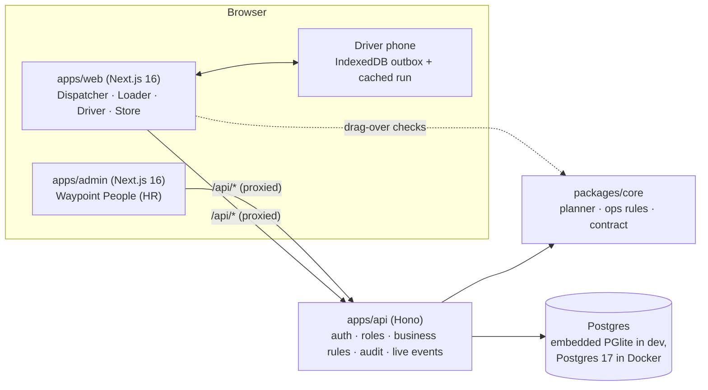
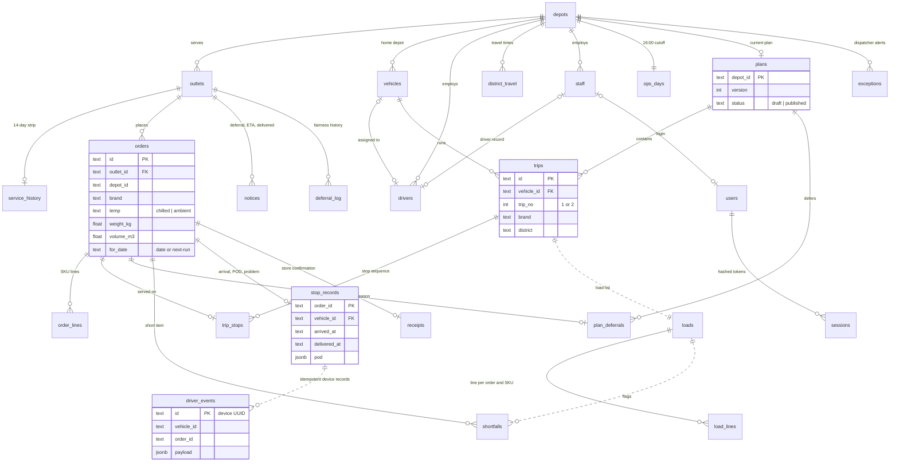

# Architecture

- **One writer.** Only the API opens the database. Both front ends proxy `/api/*` to it (Next.js rewrites), so the browser only ever talks to its own origin: no CORS, and each app keeps its own sign-in.
- **Shared rules, one source.** `packages/core` holds the planner and every operational rule (`ops.ts`). The API runs them for real. The web app runs the planner locally only for instant "can I drop here?" feedback, and the API re-validates every move.
- **Relational storage, lossless.** The rules work on one in-memory state document. For each change the API computes the rows that differ and writes them in a single transaction, together with an audit row. A refused rule or a failed transaction leaves both the state and the database unchanged. On start-up the state is reloaded from the tables. The API tests check that the reloaded state is identical.
- **Reference data from the database.** Branches, vehicles, depots and products are master data that dispatchers edit under **Network records** in the operations app. The API hydrates `@waypoint/core` with them, and the web app re-hydrates from every snapshot, so an edit reaches the planner and every screen without code changes.
- **Accounts and sessions.** Passwords are hashed with scrypt. A session is an opaque bearer token, and only its SHA-256 is stored. The operations app keeps its token per browser tab (so several roles can run side by side), and Waypoint People keeps it across tabs. Every request re-reads the account, so disabling a user or reassigning a driver's vehicle takes effect immediately.
- **People are HR's, the network is dispatch's.** Waypoint People (`/api/people`, HR officers) keeps one staff record per employee and issues logins from it. Dispatchers own the network records (`/api/network`), including which driver runs which vehicle.
- **Authorisation next to the rule.** Each operation checks the caller's role and scope, for example: a loader only at their dock, a driver only for their assigned vehicle, a store manager only for their branch (or their depot's branches for an area manager). The acting name comes from the session, never from the request body.
- **Live updates.** The API publishes a `change` event over Server-Sent Events after every write, and every open screen refetches.
- **Offline driver app.** Actions go to the IndexedDB outbox first. Sync is idempotent on the device's event UUID (`driver_events` table), and the cached run lets the app open with no signal.

## Data model

The main tables and how they connect (31 tables in all; the full column list is in `apps/api/src/db/schema.ts`, and the table groups are listed in [`INTEGRATION.md → Data model`](INTEGRATION.md#data-model)). Solid lines are foreign keys. Dashed lines link by id without a constraint, on purpose: a load list, its shortfalls and the raw device log must outlive later plan edits (a truck that has left keeps its load even if dispatch moves a stop).

Reference data the planner reads but nothing points at: `products`, `service_allowance`, `calendar_days`, `road_conditions`, `weekly_volume` and `app_meta`. `audit_log` records every write with the acting user, role and the rows it changed.

## Who can read what

`GET /api/ops/snapshot` returns a slice of the operational state per role (`visibleTo` in `packages/core/src/ops.ts`):

| Role | Receives |
|---|---|
| Dispatcher | Everything, for both depots |
| Loader | Their depot's plan, orders, load lists and shortfalls |
| Driver | Their vehicle's trips, orders, load lists, stop records and sync status |
| Store manager | Their outlet's (or, for an area manager, their depot's) orders, notices, receipts and stop records. Other orders on the same trips stay so ETAs can be computed, without their line items |
